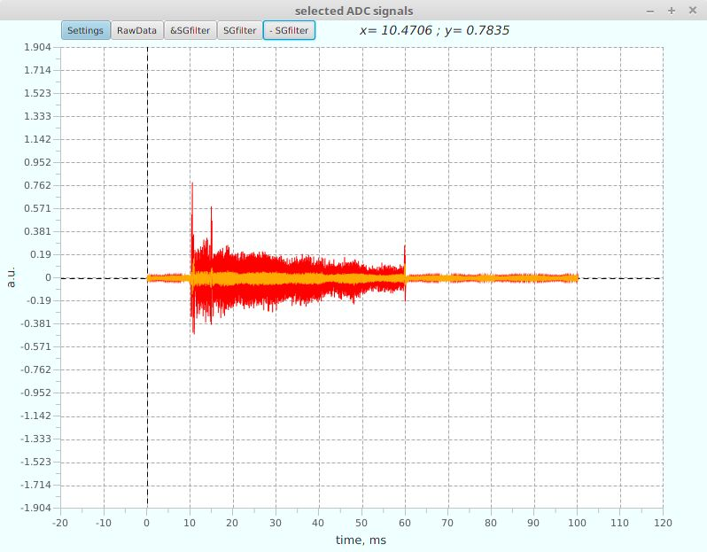

This application allows to visualize binary files created with analog digital converters:

1. L-Card L-783M, http://www.lcard.ru/products/boards/l-783
2. L-Card e20-10, http://www.lcard.ru/products/external/e20-10
3. SATURN SDI-AD12-128H, http://www.saturn-data.com

Some interactive plotter settings
and Savitsky-Golay filter are available

ADC files examples are included in the "resources/sampledata/" subfolder.
Check "resources/jpg/" subfolder with screenshots.
Executable Jar file is located in "resources/jar/" subfolder.

An information about every signal will be extracted from an appropriate
binary *.par file  in correspondence with a chosen binary *.dat file
(or from the beginning of a chosen *.dat file in case of SATURN SDI-AD12-128H)
This information will be shown in the right part of the program's main window,
according to a selected  table row.

In addition it is possible to open data presented in a text file.
For now it should be a single file per signal - with a single data column inside.
You will be prompted to enter some data manually in this case (date, channel number, ADC rate...).

How to use:
   - "File->Open" shows a file chooser dialog, files with "dat" and "txt" extensions will be available;
   - "Plot->Export all to txt " converts all signals shown in the main table
       to the text format and save it to a subfolder named "<source>/txt"
   - "Plot->Draw Plots" plots checked signals in a separate window.
   -  When plots are shown, Savitsky-Golay filter can be applied.
   -  double click on table will check/uncheck all signals
   -  individual color can be set for every signal

Zoom plots with mouse:
   - zoom: left click + drag from a top left to a bottom right
   - rescale to a full view: left click + drag back from a bottom right to a top left

NOTE: if there are a lot of points, drawing will take some time.
      Laptop with Intel i5 renders a 1 000 000 of points about 1 minute,
      in case of drawing all data "as is".
      Feature is included that enables  rapid drawing even when there are
      millions of data points. Just use zoom to view all the details.
      Canvas drawing now successfully copes with millions of data points
      due to simple "point-per-pixel" approach.

LICENSING

Copyright (c) 2016 onward, Aleksey Beletskii  <beletskiial@gmail.com>
All rights reserved

github: https://github.com/alekseybeletskii

The ADCDataViewer software serves for visualization and simple processing
of any data recorded with Analog Digital Converters in binary or text form.

Commercial support is available. To find out more contact the author directly.

Redistribution and use in source and binary forms, with or without
modification, are permitted provided that the following conditions are met:

  1. Redistributions of source code must retain the above copyright notice, this
     list of conditions and the following disclaimer.
  2. Redistributions in binary form must reproduce the above copyright notice,
     this list of conditions and the following disclaimer in the documentation
     and/or other materials provided with the distribution.

The software is distributed to You under terms of the GNU General Public
License. This means it is "free software". However, any program, using
ADCDataViewer _MUST_ be the "free software" as well.
See the GNU General Public License for more details
(file ./COPYING in the root of the distribution
or website <http://www.gnu.org/licenses/>)

THIS SOFTWARE IS PROVIDED BY THE COPYRIGHT HOLDERS AND CONTRIBUTORS "AS IS" AND
ANY EXPRESS OR IMPLIED WARRANTIES, INCLUDING, BUT NOT LIMITED TO, THE IMPLIED
WARRANTIES OF MERCHANTABILITY AND FITNESS FOR A PARTICULAR PURPOSE ARE
DISCLAIMED. IN NO EVENT SHALL THE COPYRIGHT OWNER OR CONTRIBUTORS BE LIABLE FOR
ANY DIRECT, INDIRECT, INCIDENTAL, SPECIAL, EXEMPLARY, OR CONSEQUENTIAL DAMAGES
(INCLUDING, BUT NOT LIMITED TO, PROCUREMENT OF SUBSTITUTE GOODS OR SERVICES;
LOSS OF USE, DATA, OR PROFITS; OR BUSINESS INTERRUPTION) HOWEVER CAUSED AND
ON ANY THEORY OF LIABILITY, WHETHER IN CONTRACT, STRICT LIABILITY, OR TORT
(INCLUDING NEGLIGENCE OR OTHERWISE) ARISING IN ANY WAY OUT OF THE USE OF THIS
SOFTWARE, EVEN IF ADVISED OF THE POSSIBILITY OF SUCH DAMAGE.
